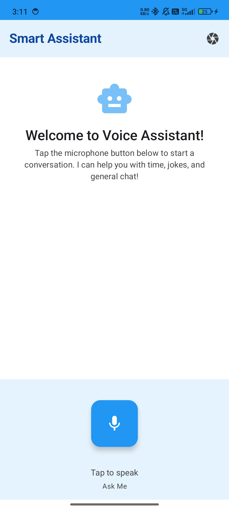
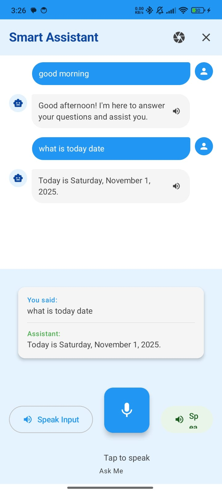
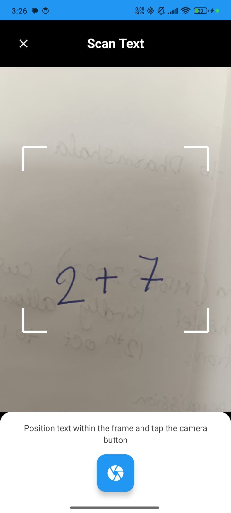
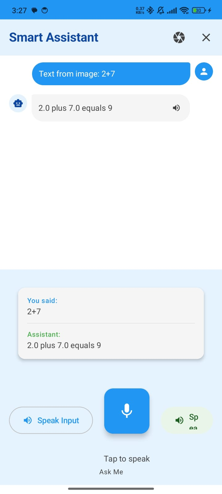

#  TTS-STT Voice Assistant


A modern **Voice Assistant Android app** built with **Kotlin** and **Jetpack Compose**, supporting both **Speech-to-Text (STT)** and **Text-to-Speech (TTS)** functionality with a sophisticated **Material Design 3** UI.

This app lets users speak into the microphone, transcribes their speech in real-time, generates smart assistant replies, and can read responses aloud using TTS.

## SnapSorts

<div align="center">

<table>
  <tr>
    <td align="center" style="padding:10px;">
      
      <br/><b>Home Screen</b>
    </td>
    <td align="center" style="padding:10px;">
      
      <br/><b>Assistant Chat Screen</b>
    </td>
    <td align="center" style="padding:10px;">
      
      <br/><b>OCR Scan Screen</b>
    </td>
    <td align="center" style="padding:10px;">
      
      <br/><b>OCR Result Screen</b>
    </td>
  </tr>
</table>

</div>


##  Features

-  **Speech-to-Text (STT)** — Converts spoken words into text with real-time partial results
-  **Text-to-Speech (TTS)** — Reads out user text or assistant replies with natural voice
-  **Modern Material 3 Design** — Built entirely with Jetpack Compose
-  **Real-time Processing** — Live transcription feedback
-  **Responsive UI** — Adaptive layouts and animations
-  **Clean Architecture** — MVVM with ViewModels + StateFlow
-  **Google Assistant-like Commands** — Supports wide range of voice interactions
-   **Chat History View** — View and restore previous conversations
-    **OCR (Optical Character Recognition)** — Scan text from images and read it aloud
-  **Smart Responses 2.0** — Contextual replies powered by on-device AI

---

##  Future Updates

Exciting features currently under development:

-  **Expanded Voice Commands** — New categories (music, notes, reminders, etc.)
-  **Multi-Language Support** — Recognize and respond in multiple Indian and global languages
-   **Smart OCR Summarization** — Extract and summarize key points from scanned text  

---

##  Tech Stack

- **Language:** Kotlin
- **UI:** Jetpack Compose + Material 3
- **APIs:** SpeechRecognizer (STT), TextToSpeech (TTS) and Gemini AI API  
- **Architecture:** MVVM + StateFlow
- **Async:** Kotlin Coroutines
- **Libraries:** ML Kit (OCR), CameraX (future)
- **Testing:** JUnit + Android Instrumentation (planned)  

---


---

##  Permissions

```xml
<uses-permission android:name="android.permission.RECORD_AUDIO" />
<uses-permission android:name="android.permission.INTERNET" />
<uses-permission android:name="android.permission.ACCESS_NETWORK_STATE" />
<uses-permission android:name="android.permission.MODIFY_AUDIO_SETTINGS" />
<uses-permission android:name="android.permission.CAMERA" />
<uses-permission android:name="android.permission.READ_EXTERNAL_STORAGE" />
```

## Installation & Usage

### Prerequisites

- Android Studio (latest version)
- Android device or emulator with API 24+
- Microphone access for speech recognition

### Setup Instructions

1. **Clone the repository**
   ```bash
   git clone https://github.com/pratish444/TTS-STT-App
   cd TTS-STT-App
   ```

2. **Open in Android Studio**
   - Open Android Studio
   - Select "Open an existing project"
   - Navigate to the TTS-STT-App folder

3. **Build the project**
   ```bash
   ./gradlew build
   ```

4. **Run on device/emulator**
   - Connect your Android device or start an emulator
   - Click Run ▶ in Android Studio or press `Shift + F10`

### How to Use

1. **Launch the App** - Open "Voice Assistant" from your app drawer

2. **Grant Permissions** - Allow microphone access when prompted

3. **Start Conversation** - Tap the animated microphone button to start listening

4. **Speak Naturally** - The app will show real-time transcription as you speak

5. **Get Responses** - The assistant will automatically respond with contextual replies

6. **Listen to Responses** - Tap the "Speak Reply" button to hear responses aloud

7. **Manage Conversation** - Use the clear button to start fresh conversations

### Voice Commands to Try

- **Greetings**: "Hello", "Hi", "Hey there"
- **Time**: "What time is it?", "Tell me the time"
- **Date**: "What's today's date?", "What day is it?"
- **Entertainment**: "Tell me a joke", "Make me laugh"
- **Weather**: "How's the weather?" (responds with friendly message)
- **Thanks**: "Thank you", "Thanks a lot"
- **Goodbye**: "Bye", "Goodbye", "See you later"

## Project Structure

```
app/src/main/java/com/example/talkmate/
├── MainActivity.kt
├── ui/
│   ├── components/
│   │   ├── SpeechAssistantScreen.kt
│   │   ├── SpeechButton.kt
│   │   └── TextDisplay.kt
│   └── theme/
│       ├── Color.kt
│       ├── Theme.kt
│       └── Type.kt
├── speech/
│   ├── SpeechToTextHelper.kt
│   └── TextToSpeechHelper.kt
├── utils/
│   └── PermissionsHelper.kt
├── ocr/
│   ├── OcrHelper.kt
│   └── CameraHelper.kt
└── model/
    └── Message.kt

```

## Architecture

The app follows **MVVM (Model-View-ViewModel)** architecture:

- **MainActivity**: Entry point with Compose UI setup
- **MainViewModel**: Manages app state and business logic
- **MainUiState**: Data class representing UI state
- **UI Components**: Reusable Compose components
- **Speech Helpers**: Dedicated classes for STT/TTS functionality

## Troubleshooting

### Common Issues:

1. **"Speech recognition not available"**
   - Ensure you're using a physical device (emulators may not support speech)
   - Check that Google app is installed and updated

2. **"Microphone permission denied"**
   - Go to Settings > Apps > Voice Assistant > Permissions
   - Enable Microphone permission

3. **"Network error"**
   - Ensure device has internet connection
   - Speech recognition requires network access

4. **TTS not working**
   - Check device TTS settings
   - Install Google Text-to-Speech if needed

## Development

### Build Commands
```bash
# Clean build
./gradlew clean build

# Debug build
./gradlew assembleDebug

# Release build
./gradlew assembleRelease

# Run tests
./gradlew test
```


## Support

If you encounter any issues or have questions:

1. Check the troubleshooting section above
2. Review the device compatibility requirements
3. Ensure all permissions are granted
4. Try using a physical device instead of emulator

---
