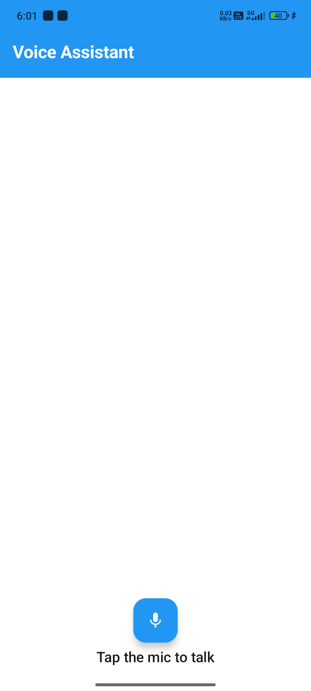

# TTS-STT Voice Assistant

## **FULLY FUNCTIONAL**

A modern **Voice Assistant Android app** built with **Kotlin** and **Jetpack Compose**, supporting
both **Speech-to-Text (STT)** and **Text-to-Speech (TTS)** functionality with a sophisticated
Material Design 3 UI.

This app lets users speak into the microphone, transcribes their speech in real-time, generates
smart assistant replies, and can read responses aloud using TTS.

<h3>App Screenshot</h3>


## Features

- **Speech-to-Text (STT)** — Converts spoken words into text with real-time partial results
- **Text-to-Speech (TTS)** — Reads out user text or assistant replies with natural voice
- **Chat-style UI** — Beautiful conversation interface with user and assistant message bubbles
- **Modern Material 3 Design** — Built with Jetpack Compose and latest design guidelines
- **Real-time Processing** — Live partial speech recognition results
- **Smart Permission Handling** — Seamless microphone access with proper error handling
- **Context-aware Responses** — Intelligent assistant replies for various user inputs
- **Responsive UI** — Adaptive layout with animated components and visual feedback
- **Advanced Components** — Sophisticated speech button with wave animations
- **Clean Architecture** — MVVM pattern with ViewModels and state management

## Tech Stack

- **Kotlin** - Modern programming language
- **Jetpack Compose** - Modern UI toolkit with Material 3
- **Android SpeechRecognizer API** - For speech-to-text functionality
- **Android TextToSpeech API** - For text-to-speech functionality
- **ViewModel & StateFlow** - For reactive state management
- **Coroutines** - For asynchronous programming
- **Material Design 3** - Latest Material Design components

## What Was Fixed

The original app had several critical issues that have been completely resolved:

### Issues Found:

1. **Package Name Inconsistency** - Mixed `ttssttapp` and `talkmate` packages
2. **Basic UI Implementation** - MainActivity had simple UI instead of using sophisticated
   components
3. **Missing ViewModel Architecture** - No proper state management
4. **Unconnected Components** - Advanced UI components weren't being used
5. **Import Conflicts** - Incorrect package references
6. **Deprecated APIs** - Using old Material Design icons
7. **Build Configuration** - Missing ViewModel dependencies

### Fixes Applied:

1. **Unified Package Structure** - Consistent `com.example.talkmate` namespace throughout
2. **Advanced UI Integration** - MainActivity now uses sophisticated `SpeechAssistantScreen` with:
    - Animated speech button with wave effects
    - Professional message bubbles with avatars
    - Current text display cards
    - Error handling with animated notifications
    - Clear conversation functionality
3. **MVVM Architecture** - Proper ViewModel with StateFlow for reactive UI updates
4. **Component Integration** - All UI components properly connected and functional
5. **Updated Dependencies** - Added ViewModel Compose support
6. **Modern APIs** - Updated to AutoMirrored icons and latest Material 3 components
7. **Clean Code Structure** - Organized into proper packages with separation of concerns

## Permissions

The app requires these permissions (automatically requested):

```xml
<uses-permission android:name="android.permission.RECORD_AUDIO" />
<uses-permission android:name="android.permission.INTERNET" />
<uses-permission android:name="android.permission.ACCESS_NETWORK_STATE" />
<uses-permission android:name="android.permission.MODIFY_AUDIO_SETTINGS" />
```

## Installation & Usage

### Prerequisites

- Android Studio (latest version)
- Android device or emulator with API 24+
- Microphone access for speech recognition

### Setup Instructions

1. **Clone the repository**
   ```bash
   git clone <repository-url>
   cd TTS-STT-App
   ```

2. **Open in Android Studio**
    - Open Android Studio
    - Select "Open an existing project"
    - Navigate to the TTS-STT-App folder

3. **Build the project**
   ```bash
   ./gradlew build
   ```

4. **Run on device/emulator**
    - Connect your Android device or start an emulator
    - Click Run ▶ in Android Studio or press `Shift + F10`

### How to Use

1. **Launch the App** - Open "Voice Assistant" from your app drawer

2. **Grant Permissions** - Allow microphone access when prompted

3. **Start Conversation** - Tap the animated microphone button to start listening

4. **Speak Naturally** - The app will show real-time transcription as you speak

5. **Get Responses** - The assistant will automatically respond with contextual replies

6. **Listen to Responses** - Tap the "Speak Reply" button to hear responses aloud

7. **Manage Conversation** - Use the clear button to start fresh conversations

### Voice Commands to Try

- **Greetings**: "Hello", "Hi", "Hey there"
- **Time**: "What time is it?", "Tell me the time"
- **Date**: "What's today's date?", "What day is it?"
- **Entertainment**: "Tell me a joke", "Make me laugh"
- **Weather**: "How's the weather?" (responds with friendly message)
- **Thanks**: "Thank you", "Thanks a lot"
- **Goodbye**: "Bye", "Goodbye", "See you later"

## Project Structure

```
app/src/main/java/com/example/talkmate/
├── MainActivity.kt                 # Main activity with ViewModel integration
├── ui/
│   ├── components/
│   │   ├── SpeechAssistantScreen.kt   # Main UI screen component
│   │   ├── SpeechButton.kt            # Animated speech button
│   │   └── TextDisplay.kt             # Message display components
│   └── theme/
│       ├── Color.kt                   # App color scheme
│       ├── Theme.kt                   # Material 3 theme
│       └── Type.kt                    # Typography definitions
├── speech/                         # Speech processing helpers
│   ├── SpeechToTextHelper.kt
│   └── TextToSpeechHelper.kt
└── utils/
    └── PermissionsHelper.kt        # Permission utilities
```

## Architecture

The app follows **MVVM (Model-View-ViewModel)** architecture:

- **MainActivity**: Entry point with Compose UI setup
- **MainViewModel**: Manages app state and business logic
- **MainUiState**: Data class representing UI state
- **UI Components**: Reusable Compose components
- **Speech Helpers**: Dedicated classes for STT/TTS functionality

## UI Features

- **Animated Speech Button**: Pulsing effect with sound wave visualization
- **Message Bubbles**: Distinct styling for user vs assistant messages
- **Real-time Feedback**: Live transcription display
- **Error Handling**: User-friendly error messages with animations
- **Responsive Design**: Adapts to different screen sizes
- **Material 3**: Latest design system with dynamic theming

## Troubleshooting

### Common Issues:

1. **"Speech recognition not available"**
    - Ensure you're using a physical device (emulators may not support speech)
    - Check that Google app is installed and updated

2. **"Microphone permission denied"**
    - Go to Settings > Apps > Voice Assistant > Permissions
    - Enable Microphone permission

3. **"Network error"**
    - Ensure device has internet connection
    - Speech recognition requires network access

4. **TTS not working**
    - Check device TTS settings
    - Install Google Text-to-Speech if needed

## Development

### Build Commands
```bash
# Clean build
./gradlew clean build

# Debug build
./gradlew assembleDebug

# Release build
./gradlew assembleRelease

# Run tests
./gradlew test
```

### Contributing

1. Fork the repository
2. Create a feature branch
3. Make your changes
4. Run tests and ensure build passes
5. Submit a pull request

## License

This project is open source and available under the [MIT License](LICENSE).

## Support

If you encounter any issues or have questions:

1. Check the troubleshooting section above
2. Review the device compatibility requirements
3. Ensure all permissions are granted
4. Try using a physical device instead of emulator

---
**The app is now fully functional with a modern, sophisticated UI and robust speech processing
capabilities!** 
